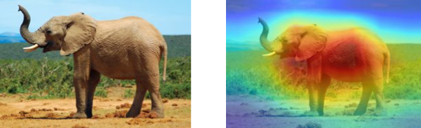
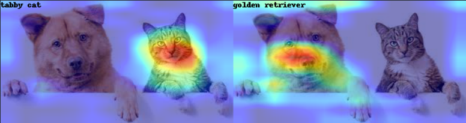
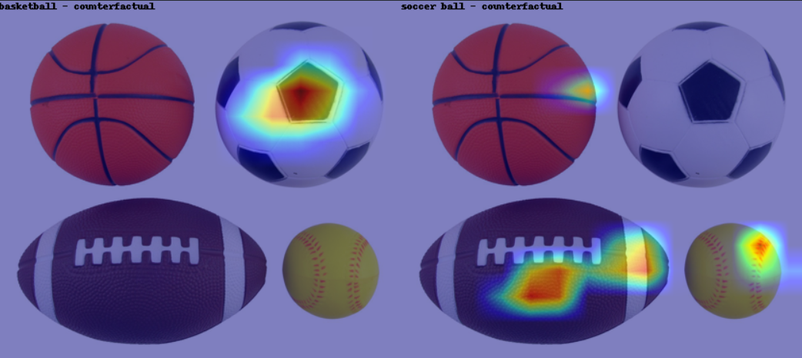
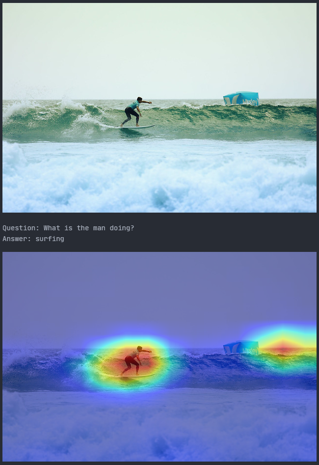

# Grad-CAM
## Statistical Methods in AI, Spring 2021

### About
Implementation based on the paper by [Selvaraju et al.](https://arxiv.org/pdf/1610.02391.pdf)

Pytorch implementation for Grad-CAM, using [pytorch hooks](https://pytorch.org/tutorials/beginner/former_torchies/nnft_tutorial.html), which enable us to access the individual gradients during backpropagation. The GradCAM implementation can look at the gradients flowing through any specified CNN layer in the model and compute a class activation mapping. By choosing the label from which we backpropagate from, it is possible to observe the regions of interest pertinent to the label. 

The implementation also includes extensions of GradCAM such as:
- Class Discriminative GradCAM
- Guided GradCAM
- Counterfactual Activation Map

### File Structure
`GradCam.py` contains the main implementation of the GradCAM and its extensions. The jupyter notebooks use modules imported from `GradCam.py`, and demonstrate their usage. 

### Results
- Base GradCAM

- Class Discriminative GradCAM

- Counterfactual​ Activation Mapping

- ​Guided GradCAM

- ​GradCAM for VQA

